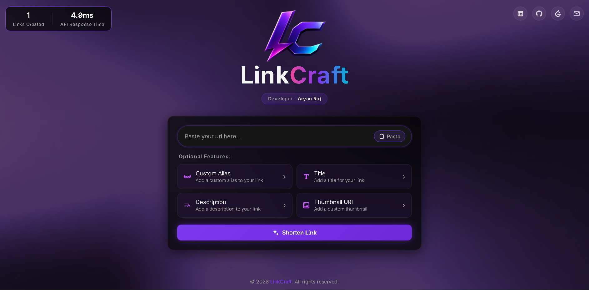

<div align="center">

# LinkCraft

**A full-stack URL shortener with branded, custom link previews.**

[Live Demo](https://linkcraft-qum3.onrender.com) · [Report Bug](https://github.com/Aryan130103/LinkCraft/issues)

</div>

<br>

<div align="center">
  
</div>

<br>

## Why I built this

At my previous company, we regularly shared LinkedIn posts on WhatsApp. Every third-party shortener we tried exposed its own branding in the URL (`tinyurl.com/...`, `bit.ly/...`) — which wasn't approved for company use. So I built LinkCraft: a shortener that runs under your own domain **and** lets you control exactly what preview (title, description, thumbnail) shows up when the link is shared — something most shorteners don't offer at all.

## Features

- 🔗 **Custom aliases** — pick your own short code (`/quarterly-report`) instead of a random one
- 🖼️ **Branded link previews** — dynamic Open Graph meta tags mean shared links show a custom title, description, and thumbnail on WhatsApp, LinkedIn, and elsewhere, instead of a generic preview
- ⚡ **Rate limiting** — 5 requests/minute per IP on link creation, protecting against spam/abuse
- ✅ **URL validation** — rejects malformed input before it touches the database
- 📊 **Live stats** — real-time link count and measured API response time, pulled straight from the backend
- 🎨 **Custom-built UI** — glassmorphic dark theme, click-to-reveal optional fields, clipboard copy/paste integration

## Tech Stack

| Layer | Tech |
|---|---|
| Backend | Python, Flask |
| Database | SQLite |
| Frontend | HTML, CSS, JavaScript (vanilla) |
| Security | Flask-Limiter (rate limiting) |
| Deployment | Render |

## How it works

1. **Shortening** — a submitted URL gets an auto-incrementing database ID, which is encoded into a compact string using **Base62** (`0-9`, `a-z`, `A-Z`) — the same technique used by production-grade shorteners to keep codes short.
2. **Custom previews** — visiting a short link doesn't redirect instantly. It first serves a lightweight HTML page containing Open Graph meta tags (title, description, image), plus a `<meta http-equiv="refresh">` tag that sends real users onward almost instantly. Crawlers (WhatsApp, LinkedIn) read the meta tags without waiting for the redirect — so both bots and humans get exactly what they need from the same page.
3. **Rate limiting** — every request to the creation endpoint is tracked by IP address; exceeding the limit returns a clean `429` response instead of crashing or spamming the database.

## API

| Endpoint | Method | Description |
|---|---|---|
| `/shorten` | `POST` | Creates a short link. Accepts `url` (required), `custom_alias`, `title`, `description`, `image_url` (all optional) |
| `/<code>` | `GET` | Redirects to the original URL, serving Open Graph tags first |
| `/stats` | `GET` | Returns live JSON: total links created, average API response time |

## Known limitations

Being upfront about trade-offs I made for this project's current scope:

- **SQLite on the free-tier host is ephemeral** — data doesn't persist across server restarts. A production version would use PostgreSQL or another persistent store.
- **IP-based rate limiting** can be bypassed by IP rotation or shared networks — acceptable for this scope, not bulletproof at scale.
- **Thumbnails are set via image URL**, not direct file upload — planned as a future enhancement.

## Run it locally

```bash
git clone https://github.com/Aryan130103/LinkCraft.git
cd LinkCraft
python -m venv venv
venv\Scripts\activate      # Windows
pip install -r requirements.txt
python app.py
```

Visit `http://127.0.0.1:5000`

## What's next

- [ ] Migrate to PostgreSQL for true data persistence
- [ ] Real image file upload instead of URL input
- [ ] Link expiry and per-link click analytics
- [ ] QR code generation for each short link

<br>

<div align="center">

Built by **Aryan Raj**

[LinkedIn](https://www.linkedin.com/in/aryan-raj-6833a2258/) · [GitHub](https://github.com/Aryan130103) · [LeetCode](https://leetcode.com/u/SleepyCoder01/) · [Email](mailto:a.raj130103@gmail.com)

</div>
